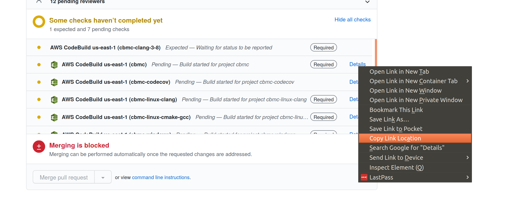

Accessing CodeBuild Logs
------------------------

The CodeBuild jobs on PRs can fail, but the logs have restricted access.

To get hold of the logs you need to do the following:

1. Get the job URL

Right click on the relevant job, and copy the link URL

2. Extract the ID

The link should look something like:

> https://us-east-1.console.aws.amazon.com/codebuild/home?region=us-east-1#/builds/cbmc-linux-clang:*a32eddfe-19e6-45d9-b0e4-d9a92e5b5698*/view/new

The job ID is the UID following the title of the job, int his case:

> `a32eddfe-19e6-45d9-b0e4-d9a92e5b5698`

3. Download the log

Go to the following URL:

http://cbmclogs.diffblue.com/{job-name}/{job-id}.gz

Where `job-name` is the name of the job (e.g. `cbmc` or `cbmc-linux-clang`) and `job-id` is the ID extracted in the previous step.
