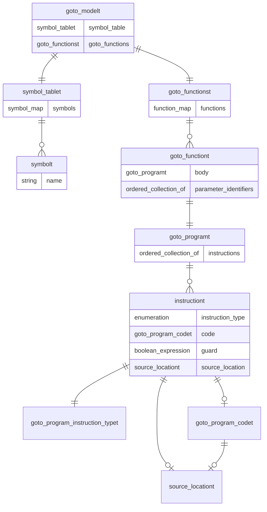

\ingroup module_hidden

\page central-data-structures Central Data Structures

# Central Data Structures

The following is some light technical documentation of the major data structures
used in the input transformation to Intermediate Representation (IR) inside
CBMC and the assorted CProver tools.

## GOTO models

The `goto_modelt` class is the top-level data structure that CBMC (and the other
tools) use for holding the GOTO intermediate representation. The following
diagram is a simplified view of how the data structures relate to each other -



A `goto_modelt` is effectively a pair, consisting of:

* A collection of GOTO functions.
* A symbol table containing symbol definitions which may be referred to by
  symbol expressions. Symbol expressions are found in the goto functions and the
  (sub-)expressions for the definitions of symbols.

In pseudocode, the type looks this:

```js
type goto_modelt {
  type goto_functionst = map<identifier, goto_functiont>
  type symbol_tablet = map<identifier, symbolt>
}
```

There is an abstract interface for goto models provided by the
`abstract_goto_modelt` class. This is defined and documented in the file
[`src/goto-programs/abstract_goto_model.h`](../../src/goto-programs/abstract_goto_model.h).
Ideally code which takes a goto model as input should accept any implementation
of the abstract interface rather than accepting the concrete `goto_modelt`
exclusively. This helps with compatibility with `jbmc` which uses lazy loading.
See the `lazy_goto_modelt` class which is defined and documented in
[`jbmc/src/java_bytecode/lazy_goto_model.h`](../../jbmc/src/java_bytecode/lazy_goto_model.h)
for details of lazy loading.

For further information about symbols see the `symbolt` class which is defined
and documented in [`src/util/symbol.h`](../../src/util/symbol.h) and the
`symbol_exprt` (symbol expression) class which is defined and documented in
[`src/util/std_expr.h`](../../src/util/std_expr.h).

## goto_functiont

A `goto_functiont` is also defined as a pair. It's designed to represent a function
at the goto level, and effectively it's the following data type (in pseudocode):

```js
type goto_functiont {
    goto_programt body
    list<identifiers> parameters
}
```

The `goto_programt` denoting the `body` of the function will be the subject of
a more elaborate explanation in the next section.

The `parameters` subcomponent is a list of identifiers that are to be looked-up
in the symbol-table for their definitions.

## goto_programt

A  goto program  is a sequence of GOTO instructions (`goto_instructiont`). For
details see the documentation of the `goto_programt` class.

An instruction (`goto_instructiont`) is a triple (an element with three subcomponents),
describing a GOTO level instruction with the following 3 component subtypes,
again in pseudocode:

```js
type goto_instructiont {
    instruction_type instr_type
    instruction      statement
    guard            boolean_expr
}
```

The pseudocode subtypes above require some more elaboration, so we will provide some extra
detail to illuminate some details at the code level:

* The `instruction_type` above corresponds to the `goto_program_instruction_typet` type
  listed in [`goto_program.h`](../../src/goto-programs/goto_program.h)
  * Some illustrative instruction types are `assign`, `function_call`, `return`, etc.
* The `instruction` is a statement represented by a `goto_instruction_codet`.
  * A `goto_instruction_codet` is an alias of `codet` (a data structure broadly representing
    a statement inside CBMC) that contains the actual code to be executed.
  * You can distinguish different statements by inspecting the `irep` element `ID_statement`.
* The `guard` is an `exprt` (a data structure broadly representing an expression inside CBMC)
  that is expected to have type `bool`.
  * This is optional - not every instruction is expected to have a `guard` associated with it.

## source_locationt

Another important data structure that needs to be discussed at this point is
`source_locationt`.

This is an `irept`. `irep`s are the central data structure that model most entities inside
CBMC and the assorted tools - effectively a node/map like data structure that forms a hierachical
tree that ends up modeling graphs like ASTs, CFGs, etc.

`source_locationt` are attached into various `exprt`s (the data structure representing
various expressions, usually the result of some early processing, e.g. the result of the
frontend parsing a file).

This means that `codet`s, representing GOTO instructions *also* have a `source_locationt`
attached to them, by virtue of inheriting from `exprt`.

For the most part, `source_locationt` is something that is only being used when we print
various nodes (for property listing, counterexample/trace printing, etc).

It might be possible that a specific source location might point to a CBMC instrumentation
primitive (which might be reported as a `built-in-addition`) or there might even be no-source
location (because it might be part of harnesses generated as an example, that have no presence
in the user code).
